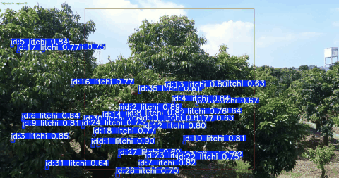
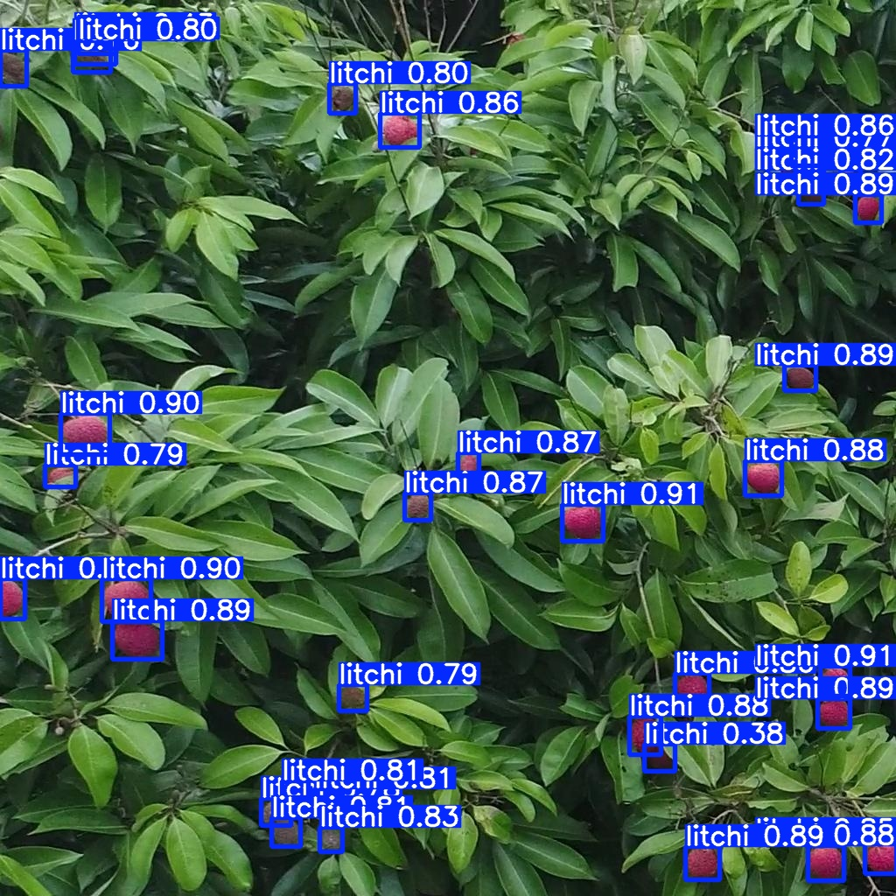

# Litchi-SORT

Official implementation of **Litchi-SORT: Overcoming Occlusion and Motion Instability for Accurate Low-Altitude UAV-Based Litchi Tracking and Counting**.

This repository provides the **source code** and **pretrained weights** for our litchi detection, tracking, and counting pipeline. The manuscript is currently under review. The **static image** dataset has been made publicly available via Zenodo. The continuous **UAV video dataset** and corresponding tracking annotations will be released progressively upon publication.

## Overview

Real-time multi-object tracking in large-scale UAV video streams is challenging due to dense clustering, severe occlusion, drastic scale variation, and motion blur. To address these issues, we propose **Litchi-SORT**, a robust tracking and counting framework tailored for low-altitude UAV-based litchi monitoring.

Compared with the BoT-SORT baseline, Litchi-SORT improves robustness through:

- A region-based counting method with a frame threshold to suppress transient tracking errors
- A Kalman Filter with Dynamic Adaptive Noise Covariance for more stable state estimation
- A multi-model motion filtering and trajectory smoothing strategy for improved prediction
- EIoU-based data association for dense-object scenarios

## Demo

### Tracking Result

GIF preview:

[](video/litchi9_result.mp4)

### Detection Result



## Performance Comparison

| Method | MOTA (%) ↑ | IDF1 (%) ↑ | HOTA (%) ↑ | IDSW ↓ | TF ↓ |
| --- | ---: | ---: | ---: | ---: | ---: |
| SORT | 64.13 | 83.24 | 73.68 | 157.2 | 85.9 |
| DeepSORT | 68.11 | 85.13 | 76.62 | 145.7 | 84.7 |
| StrongSORT | 71.53 | 86.76 | 79.14 | 129.4 | 83.6 |
| ByteTrack | 74.76 | 87.29 | 81.02 | 118.5 | 82.6 |
| BoT-SORT | 75.28 | 87.52 | 81.40 | 114.1 | 82.5 |
| **Litchi-SORT** | **77.26** | **89.09** | **83.57** | **85.1** | **81.2** |

## Installation

### 1. Clone the repository

```bash
git clone https://github.com/Lide4Code/Litchi-SORT.git
cd Litchi-SORT
```

### 2. Create a Python environment

```bash
conda create -n litchi-sort python=3.10 -y
conda activate litchi-sort
```

### 3. Install dependencies

```bash
pip install -r requirements.txt
```

Notes:

- A CUDA-capable GPU is strongly recommended for tracking on UAV videos
- Released model files are provided under `models/`
- `track.py` will first try `runs/train/model/weights/best.pt`, and automatically fall back to `models/yolov11-litchi.pt`

## Quick Start

The easiest way to reproduce the tracking result is to run `track.py`.

### Run tracking and counting

```bash
python track.py \
  --input video/litchi9.mp4 \
  --output runs/track/litchi9_demo \
  --save-scale 0.5 \
  --save-fps 30 \
  --blur-kernel 3
```

This command will generate:

- A tracking video: `runs/track/litchi9_demo/litchi9_result.mp4`
- A tracking result text file: `runs/track/litchi9_demo/litchi9.txt`

### Output arguments

`track.py` supports several useful options for export:

- `--save-scale`: downscale the saved video to reduce file size
- `--save-fps`: change the saved video FPS, default is to follow the source video
- `--blur-kernel`: lightly blur the saved video to reduce bitrate and make playback smoother
- `--codec`: choose output codec, such as `auto`, `avc1`, `H264`, or `mp4v`

### Optional image detection example

```bash
python detect.py \
  --input image/litchi.jpg \
  --output detection_results \
  --folder demo
```

## Repository Structure

- `track.py`: main litchi tracking and counting entry point
- `detect.py`: image detection demo
- `models/`: released model files in `.pt`, `.onnx`, and `.engine` formats
- `image/`: demo images for README and testing
- `video/`: demo videos and tracking results

## 🚀 Open-Source Plan

- ✅ **Phase 1 (Available Now)**
  - 💻 Source code for the Litchi-SORT pipeline
  - 📦 Pretrained model weights
  - 🖼️ Static image dataset (Hosted on Zenodo: [10.5281/zenodo.19364014](https://doi.org/10.5281/zenodo.19364014))

- ⏳ **Phase 2 (Coming Soon)**
  - 🎥 Complete low-altitude UAV video dataset
  - 📝 Continuous multi-object tracking annotations


## License

This repository is released under the license provided in [LICENSE](LICENSE).
